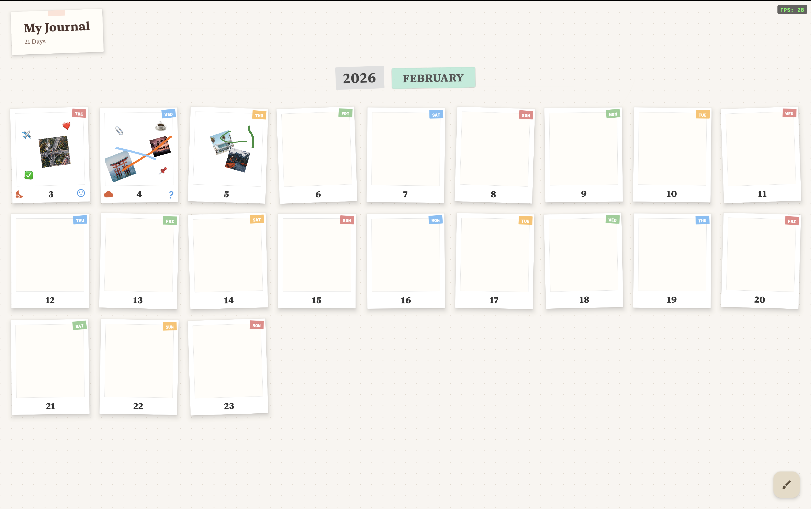
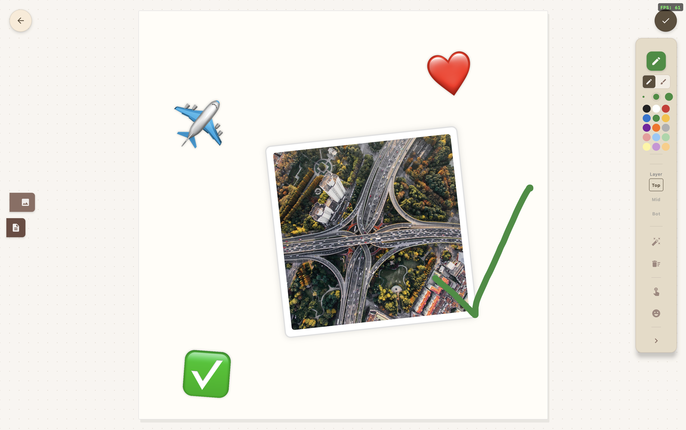
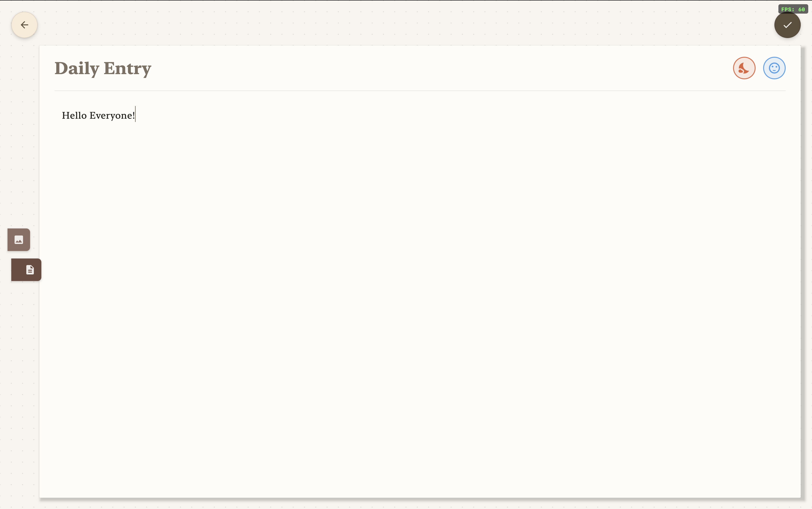
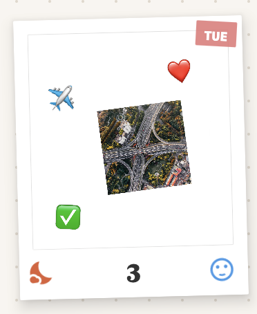
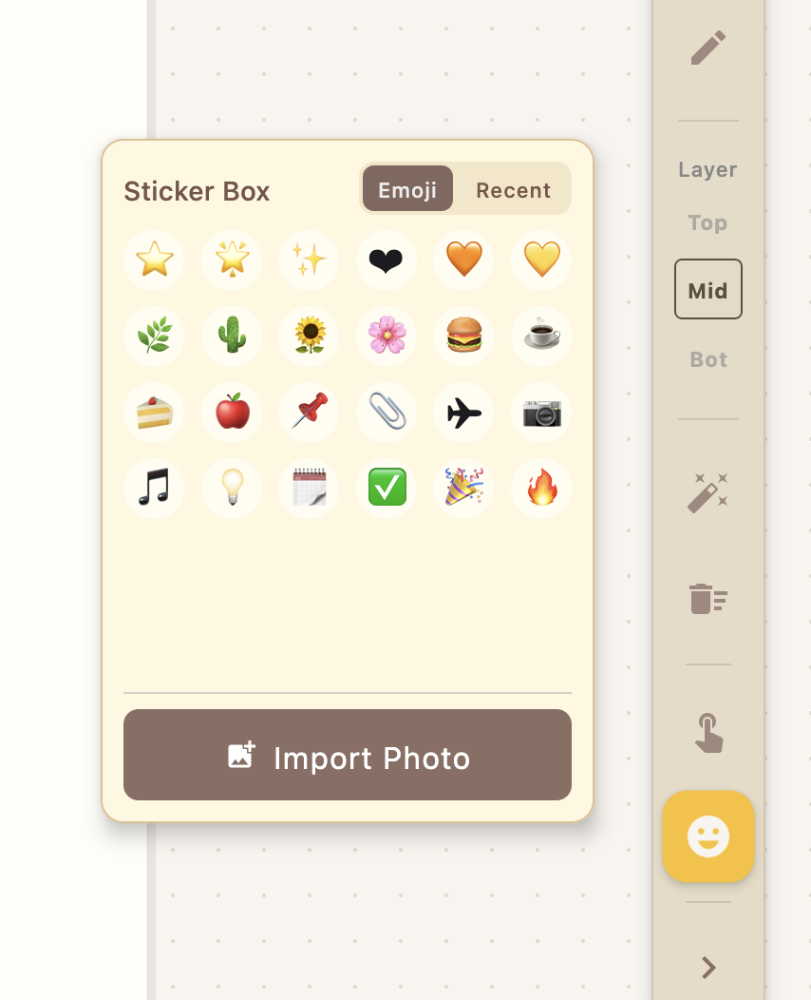
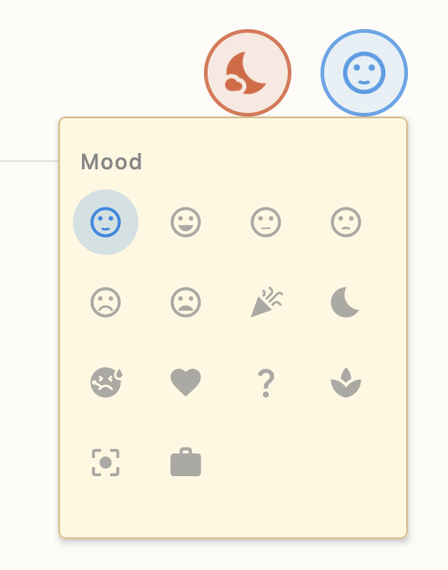
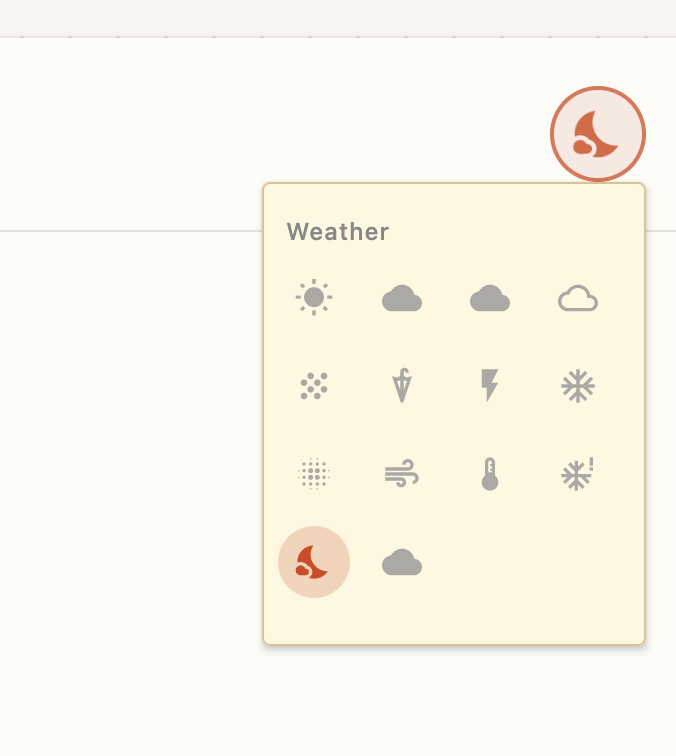

<div align="center">
  <h1>📸 Visual Life Log (VisualLog)</h1>
  <p>A beautiful, local-first, and highly interactive journal to visually track your days, moods, and memories. Built with Kotlin and Compose Multiplatform.</p>

  <p>
    <a href="#-features">Features</a> •
    <a href="#-screenshots">Screenshots</a> •
    <a href="#-supported-platforms">Platforms</a> •
    <a href="#-getting-started">Installation & Build</a> •
    <a href="#%EF%B8%8F-tech-stack">Tech Stack</a>
  </p>
</div>

---

## 🌟 Features

**Visual Life Log** moves beyond traditional text-based diaries. It utilizes a spatial, interactive whiteboard where your daily entries become personalized collages.

* 📅 **Infinite Life Grid View**: Traverse through your timeline seamlessly. Every cell represents a day, showing a generated thumbnail of your canvas.
* 🎨 **Interactive Whiteboard Canvas**: Click on any day to open a freeform editor. Tap, drag, resize, and rotate elements exactly how you want them.
* 🏷️ **Rich Sticker System**: Includes a Samsung-style sticker drawer. Easily drop in built-in static or animated stickers, emojis, and visual flair.
* 🖼️ **Media & Photo Import**: Import and arrange your own photos onto the canvas. Set custom backgrounds for any given day.
* ✍️ **Journaling & Text Entries**: Write rich text updates to preserve your thoughts alongside your photos.
* ☁️ **Mood & Weather Tracking**: Dedicated modules to log how you felt and what the weather was like, giving you quick insights at a glance.
* ⚡ **Hardware Accelerated UI**: Leverages Skia and GPU acceleration (such as Apple Metal) to guarantee silky smooth 60+ FPS animations and zooming.
* 🔒 **100% Offline & Private**: No cloud syncing, no accounts, no data collection. Everything is stored locally in an embedded SQLite database on your machine.

---

## 📸 Screenshots

### 1. Life Grid View

*An overview of your days with auto-generated thumbnail previews.*

### 2. Daily Whiteboard Editor 

*The interactive canvas for adding stickers, photos, and journal entries.*

### 3. Journaling & Text Entry

*Writing rich text updates to remember the details of your day.*

### 4. Stickers & Customization

*Placing, resizing, and interacting with custom stickers on the canvas.*

### 5. Emoji & Photo Tools


*Quickly dropping in emojis and importing your favorite photos.*

### 6. Mood & Weather Tracking


*Easily logging your daily mood and weather for a quick glance.*

---

## � Supported Platforms

VisualLog is a **Desktop Application** built using Compose Multiplatform. It is designed to run natively on major operating systems:

- 🍎 **macOS** (Intel & Apple Silicon / M-Series)
- 🪟 **Windows** (x64)
- 🐧 **Linux** (Debian/Ubuntu-based distributions)

*Note: Mobile versions for iOS and Android are not currently built, but the underlying UI framework supports them for future expansion.*

---

## �🚀 Getting Started (Installation & Build)

### Prerequisites
To run or build the application from source, you must have the Java Development Kit installed:
- [JDK 18 or higher](https://adoptium.net/)

### 1. Running Locally (Development)

Clone the repository and run the app directly using the Gradle wrapper.

```bash
# Clone the repository
git clone https://github.com/JohnChuhengYu/VisualLog.git
cd VisualLog

# Run the application (cross-platform)
./gradlew run
```

*For macOS/Linux users, you can also use the provided shell script:*
```bash
chmod +x run.sh
./run.sh
```

### 2. Building for Production (Deploying)

If you want to package the app into a standalone installer (.dmg for Mac, .msi for Windows, .deb for Linux) to distribute or install permanently on your machine:

```bash
./gradlew package
```

**Where to find the built installers:**
After the build finishes, look inside the following directory:
`build/compose/binaries/main-release/`
- **macOS (Dmg)**: `.../dmg/VisualLog-1.0.0.dmg`
- **Windows (Msi)**: `.../msi/VisualLog-1.0.0.msi`
- **Linux (Deb)**: `.../deb/visuallog-1.0.0.deb`

*(Note: Installers are built for the OS you run the command on. e.g., You must run `./gradlew package` on a Mac to build a macOS `.dmg` file).*

---

## 🛠️ Tech Stack

- **Language**: [Kotlin](https://kotlinlang.org/) (1.9.22)
- **UI Framework**: [Compose Multiplatform for Desktop](https://www.jetbrains.com/lp/compose-multiplatform/) (1.6.0)
- **Database Architecture**: [SQLite](https://sqlite.org/) paired with [JetBrains Exposed](https://github.com/JetBrains/Exposed) (JDBC)
- **Concurrency**: Kotlinx Coroutines (Main & IO Dispatchers)
- **Logging Engine**: SLF4J

---

## ⚙️ Advanced Configuration (Debug Mode)

The app features a hidden debug menu designed for testing the grid layout generation.
1. Focus the application window.
2. Press the `K` key exactly **8 times** in quick succession.
3. A dialog will appear allowing you to override the app's initialization date to fetch past histories.

---

<div align="center">
  <p>Built with ❤️ using Compose Multiplatform.</p>
</div>
